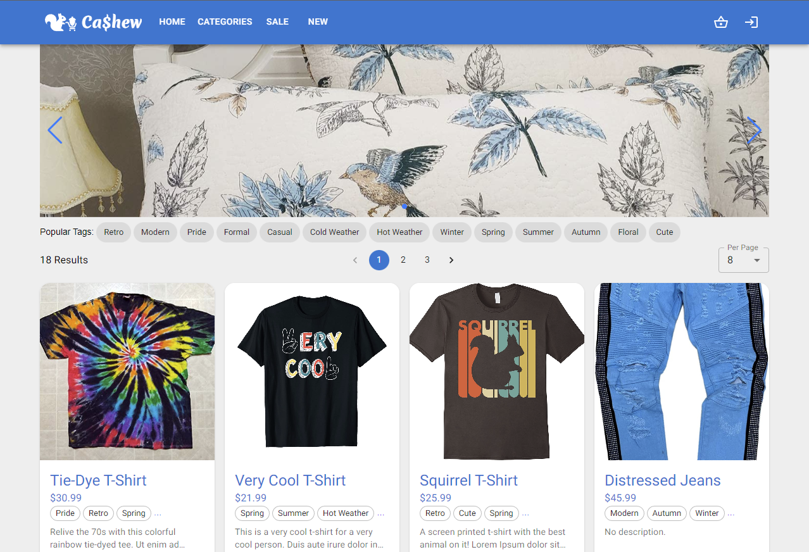
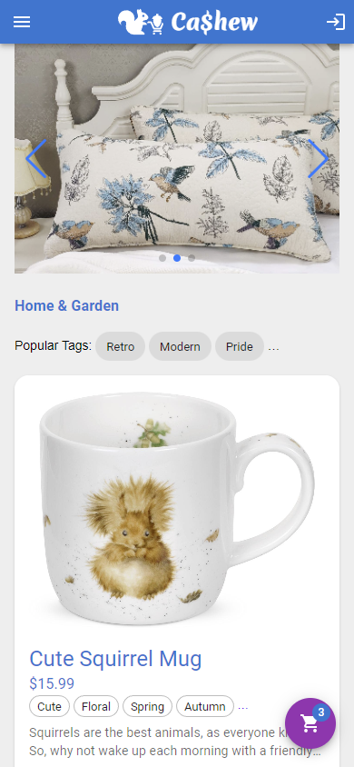
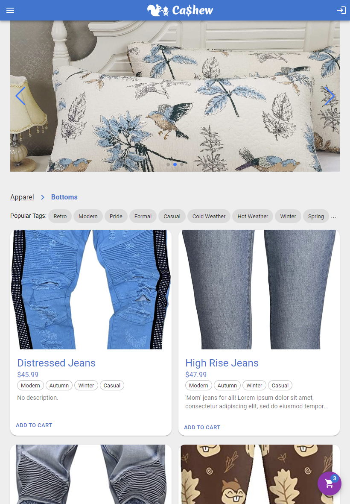
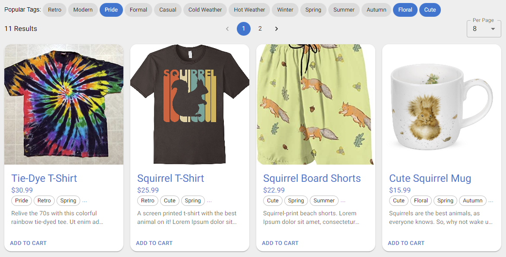
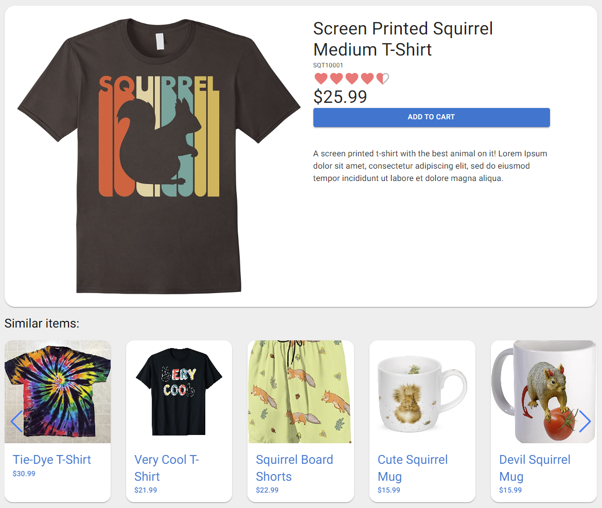
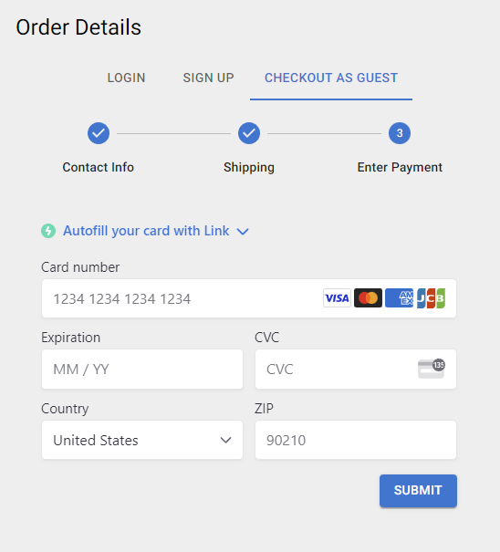

# React + Stripe Storefront 


An online shop React webapp where customers can browse products by category and filter by tags, then checkout securely via Stripe payment.

<div style="display: flex; flex-flow: row wrap; gap: 10px; width: 100%">
  
  
  
</div>

See live demo site [here](https://react-stripe-storefront.herokuapp.com/).

---

# Features

## Promo Banner

An autoscrolling carousel banner allows for display of promotional images.


## Product Browsing by Category


## Product Filtering by Tags

Products can be filtered by any number of tags selected from the tag bar on the homepage or any single category page.



## Product Recommendations

On a single product page, similar products are recommended by tags in common with the product being viewed.



## Pagination

Data queries are paginated on the back-end to reduce data sizes potentially sent over mobile data. The `pagination` attribute contains the current `page`, quantity of results `perPage`, and a total `count` of database results.

```json
{
  "data": {
    "products": {
      "pagination": {
        "page": 2,
        "perPage": 8,
        "count": 18
      },
      "results": [
        product data...
        ...
```

If `page` number and `perPage` quantity are not given in query variables, the complete result set is returned.

## Cart

The cart sidebar allows for adjusting quantities, removing items, proceeding to the cart page, or proceeding to checkout.


## Stripe Checkout

Secure credit card checkout via Stripe API.



---

## Tech Stack


## Author

|  | [<svg role="img" viewBox="0 0 24 24" height=24 fill="white" xmlns="http://www.w3.org/2000/svg"><title>GitHub</title><path d="M12 .297c-6.63 0-12 5.373-12 12 0 5.303 3.438 9.8 8.205 11.385.6.113.82-.258.82-.577 0-.285-.01-1.04-.015-2.04-3.338.724-4.042-1.61-4.042-1.61C4.422 18.07 3.633 17.7 3.633 17.7c-1.087-.744.084-.729.084-.729 1.205.084 1.838 1.236 1.838 1.236 1.07 1.835 2.809 1.305 3.495.998.108-.776.417-1.305.76-1.605-2.665-.3-5.466-1.332-5.466-5.93 0-1.31.465-2.38 1.235-3.22-.135-.303-.54-1.523.105-3.176 0 0 1.005-.322 3.3 1.23.96-.267 1.98-.399 3-.405 1.02.006 2.04.138 3 .405 2.28-1.552 3.285-1.23 3.285-1.23.645 1.653.24 2.873.12 3.176.765.84 1.23 1.91 1.23 3.22 0 4.61-2.805 5.625-5.475 5.92.42.36.81 1.096.81 2.22 0 1.606-.015 2.896-.015 3.286 0 .315.21.69.825.57C20.565 22.092 24 17.592 24 12.297c0-6.627-5.373-12-12-12"/></svg>](https://github.com/StarryBlue7) | [<svg role="img" viewBox="0 0 24 24" height=24 fill="white" xmlns="http://www.w3.org/2000/svg"><title>LinkedIn</title><path d="M20.447 20.452h-3.554v-5.569c0-1.328-.027-3.037-1.852-3.037-1.853 0-2.136 1.445-2.136 2.939v5.667H9.351V9h3.414v1.561h.046c.477-.9 1.637-1.85 3.37-1.85 3.601 0 4.267 2.37 4.267 5.455v6.286zM5.337 7.433c-1.144 0-2.063-.926-2.063-2.065 0-1.138.92-2.063 2.063-2.063 1.14 0 2.064.925 2.064 2.063 0 1.139-.925 2.065-2.064 2.065zm1.782 13.019H3.555V9h3.564v11.452zM22.225 0H1.771C.792 0 0 .774 0 1.729v20.542C0 23.227.792 24 1.771 24h20.451C23.2 24 24 23.227 24 22.271V1.729C24 .774 23.2 0 22.222 0h.003z"/></svg>](https://www.linkedin.com/in/vince-lee/) | [Portfolio](https://starryblue7.github.io/portfolio-iv/) |
| :---: | --- | --- | --- |
| Vince Lee | | | |

## License

[](https://vince-lee.mit-license.org/)

## Acknowledgements

- Swipeable carousel via [Swiper](https://swiperjs.com/).
- Toast notifications via [React-Toastify](https://fkhadra.github.io/react-toastify/introduction).
- Stock product images provided by [Foter](https://foter.com/).
