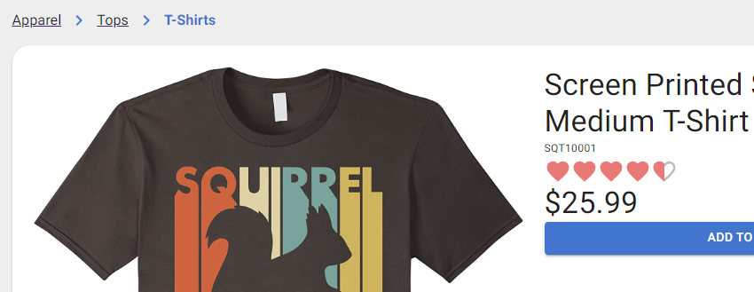

# React + Stripe Storefront 


An online shop React webapp where customers can browse products by category and filter by tags, then checkout securely via Stripe payment.

<div style="display: flex; flex-flow: row wrap; gap: 10px; width: 100%">
  
  
  
</div>

See live demo site [here](https://react-stripe-storefront.herokuapp.com/).

---

# Features

## Promo Banner

An autoscrolling carousel banner allows for display of promotional images.


## Product Browsing by Category



## Product Filtering by Tags

Products can be filtered by any number of tags selected from the tag bar on the homepage or any single category page.


## Product Recommendations

On a single product page, similar products are recommended by tags in common with the product being viewed.


## Pagination

Data queries are paginated on the back-end to reduce data sizes potentially sent over mobile data. The `pagination` attribute contains the current `page`, quantity of results `perPage`, and a total `count` of database results.

```json
{
  "data": {
    "products": {
      "pagination": {
        "page": 2,
        "perPage": 8,
        "count": 18
      },
      "results": [
        ...
```

If `page` number and `perPage` quantity are not given in query variables, the complete result set is returned.

## Cart

The cart sidebar allows for adjusting quantities, removing items, proceeding to the cart page, or proceeding to checkout.


## Stripe Checkout

Secure credit card checkout via Stripe API.


---

## Tech Stack


## Author

<!-- <div style="display: flex; gap: 15px; align-items: center; margin-bottom: 20px">
  <div style="display: flex; flex-flow: column; align-items: center">
    
    Vince Lee
  </div>
  <a href="https://github.com/StarryBlue7">
    
  </a>
  <a href="https://www.linkedin.com/in/vince-lee/">
    
  </a>
  <a href="https://starryblue7.github.io/portfolio-iv/" style="font-weight: bold">Portfolio</a>
</div> -->

<div><!-- .element: style="display: flex; gap: 15px; align-items: center; margin-bottom: 20px" -->
  <div><!-- .element: style="display: flex; flex-flow: column; align-items: center" -->
    
    Vince Lee
  </div>
  <a href="https://github.com/StarryBlue7">
    
  </a>
  <a href="https://www.linkedin.com/in/vince-lee/">
    
  </a>
  <a href="https://starryblue7.github.io/portfolio-iv/" style="font-weight: bold">Portfolio</a>
</div>


## License

[](https://vince-lee.mit-license.org/)

## Acknowledgements

- Swipeable carousel via [Swiper](https://swiperjs.com/).
- Toast notifications via [React-Toastify](https://fkhadra.github.io/react-toastify/introduction).
- Stock product images provided by [Foter](https://foter.com/).
